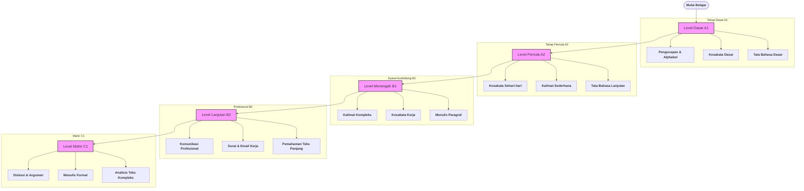

# 🇩🇪 Roadmap Belajar Bahasa Jerman (Standar LPK)

Roadmap ini disusun mengikuti pola pembelajaran **LPK (Lembaga Pelatihan Kerja)** yang berorientasi pada kebutuhan praktis kerja, magang, dan *Ausbildung* di Jerman.

---

## 🎯 Tujuan Akhir
* **Sertifikasi:** Lulus ujian Goethe / TELC / ÖSD.
* **Karir:** Siap kerja di Jerman (Industri, Caregiver, Perhotelan).
* **Komunikasi:** Mampu komunikasi formal & profesional.

---

## 🗺️ Alur Pembelajaran (Roadmap)

---

## 📘 Detail Materi per Level

### 🟢 Level A1 – Dasar (Pemula Mutlak)
* **Target:** Bisa memperkenalkan diri & memahami percakapan sangat dasar.
* **Materi:** Alphabet, Angka, Waktu, Artikel (der, die, das), Präsens.
* **Latihan:** Dialog perkenalan, mengisi formulir sederhana.

### 🟡 Level A2 – Pemula Aktif
* **Target:** Komunikasi sehari-hari & situasi kerja ringan.
* **Materi:** Perfekt (lampau), Modalverben, Dativ & Akkusativ.
* **Latihan:** Roleplay di tempat kerja, menulis pesan pendek.

### 🔵 Level B1 – Menengah (Standar Kerja)
* **Target:** Standar minimal kerja & Ausbildung.
* **Materi:** Nebensatz (weil, dass, wenn), Passive voice, Kosakata industri.
* **Latihan:** Wawancara kerja simulasi, menulis CV (Lebenslauf).

### 🟠 Level B2 – Lanjutan Profesional
* **Target:** Lancar kerja & komunikasi formal.
* **Materi:** Konjunktiv II, Idiom, Bahasa teknis, Presentasi resmi.
* **Latihan:** Menulis email resmi, diskusi kasus kerja nyata.

### 🔴 Level C1 – Mahir
* **Target:** Profesional & Akademik tinggi.
* **Materi:** Struktur argumen kompleks, penulisan laporan formal.
* **Latihan:** Debat formal, simulasi meeting profesional.

---

## 🛠️ Tools Pendukung (Rekomendasi LPK)
* **Buku Utama:** Menschen, Schritte International, Aspekte Neu.
* **Listening:** DW Deutsch Lernen (Nicos Weg).
* **Kamus:** Dict.cc atau Leo.org.
* **Ujian:** Goethe / TELC / ÖSD.

---

> [!TIP]
> Fokuslah pada **Sprechen** (berbicara) setiap hari, karena standar LPK mengutamakan keberanian berkomunikasi di lingkungan kerja Jerman.

---
© 2026 Roadmap German Learning – LPK Oriented
